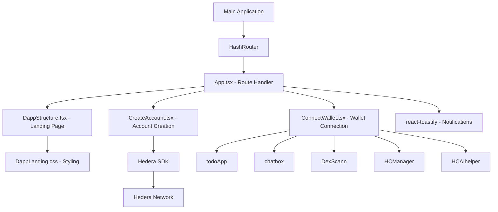
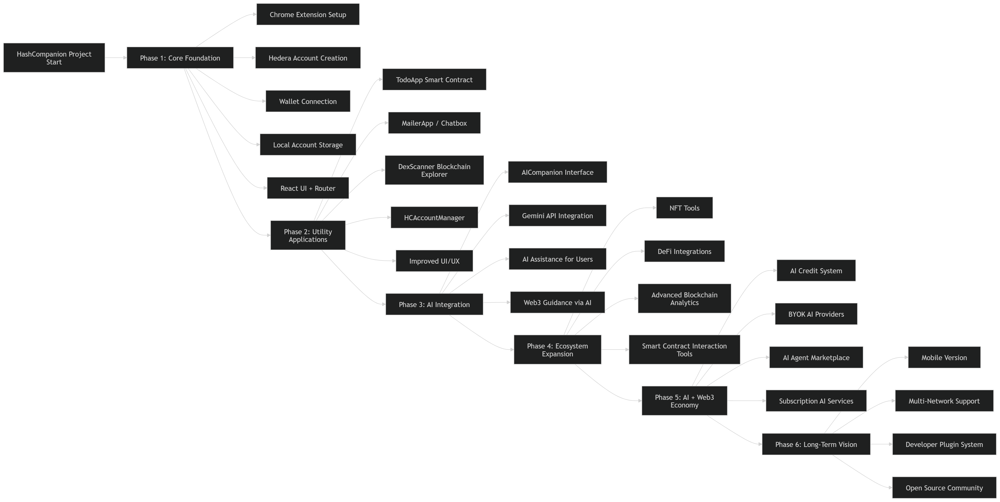
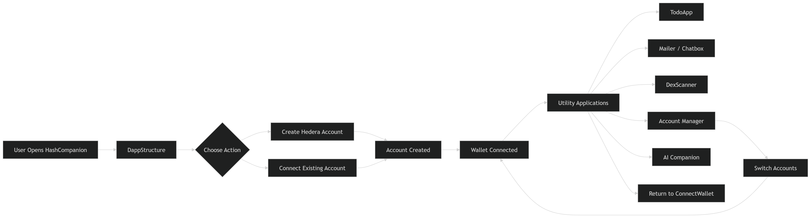
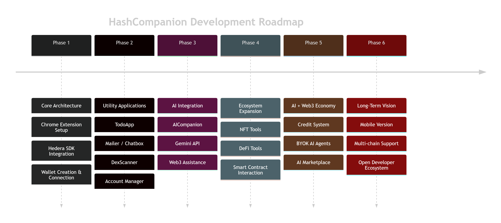

# HashCompanion Suite 

Welcome to **HashCompanion**, your gateway into the Web3 ecosystem on **Hedera Hashgraph**.  
Everything you need — from notes and messaging to blockchain exploration — is now available in **one unified platform**.

---

## Features

| Feature | Description |
|---------|-------------|
| **Unified Wallet** | Connect and manage your Hedera wallet across all apps. |
| **Secure Notes** | Create and store notes with full ownership on the blockchain. |
| **Private Messaging** | End-to-end encrypted messaging with full user control. |
| **Blockchain Explorer** | Track your transactions and account activity on Hedera. |
| **Decentralized & Private** | No central servers — your data is fully yours. |

---

## Apps Overview

## **HashCompanion**
Your gateway to Web3 on Hedera — everything in one app.  
Currently integrated with DApp3.

**Overview:**  
HashCompanion acts as a central hub for managing all your Hedera-based applications. Connect wallets, explore decentralized apps, and track your activity in one unified platform.


## **SimpleNotes**
A decentralized notes application built on Hedera Hashgraph.  
Secure, private, and fully owned by you.

**Overview:**  
SimpleNotes allows you to create, store, and manage notes directly on the blockchain. By removing centralized authentication, you maintain full control over your data and identity through Hedera wallet integration.


## **HashMessages - chatbox**
A private, fully ownable messaging platform — freedom of communication on the blockchain.

**Overview:**  
HashMessages enables secure, end-to-end encrypted messaging without reliance on central servers. All messages are tied to your Hedera account, giving you full ownership and privacy.


## **HCScanner - DexScan**
Explore and track your Hedera operations.  
Search account activity and interactions across the network.

**Overview:**  
HCScanner is a blockchain explorer for your Hedera operations. Track transactions, inspect account activity, and explore interactions across the network — all from one application.


## **HCAccountManager**

Manage your different accounts by importing them and easily switching between them to facilitate multi-account usage.

**Overview**
HashCompanion Account Manager helps you manage the various accounts you have created through HashCompanion or on the Hedera network, providing smooth usability and effortless switching between accounts

## **HashCompanion AI Copilot - HCAIhelper**

**HashCompanion AI** is a Web3 AI assistant and blockchain copilot built on **Hedera Hashgraph** and powered by **Google Gemini AI**.  
It allows users to interact with their Hedera wallet, summarize chat conversations, ask AI questions, and **execute HBAR transactions directly from natural language commands**.  

This project combines **AI agent capabilities** with **OpenClaw agent-native behavior**, making it suitable for both **AI Agent** and **OpenClaw – Agentic Society** hackathon tracks.


## Features

### 1. Wallet Awareness
- Display Hedera **Account ID** and **EVM address**.  
- Check balance and wallet status directly through AI commands.

**Example Command:**  
```

What is my wallet?

```


### 2. AI Chat Assistant
- Chat with **Google Gemini AI** directly in the app.  
- Ask general Web3 questions, get explanations, or casual chat.

**Example Command:**  
```

Explain Hedera in simple terms

```


### 3. Chat Summarization
- Summarize your conversation history.  
- AI provides a concise summary of your chat with the assistant.

**Example Command:**  
```

Summarize the chat

```


### 4. HBAR Transaction Execution (Natural Language)
- Send HBAR to any Hedera account using **plain English commands**.  
- AI parses amount + recipient and executes transactions securely.

**Example Command:**  
```

Send 1 HBAR to 0.0.12345

```

### 5. Persistent Chat Memory
- All chat messages are saved in `localStorage` for persistence.  
- Summarization and AI responses are aware of past context.

### 6. Send messages 
- is a functionality where the connected -registered user (mandatory) on the chatbox dapp can send a message to another registered user


**Example Command:**  
```

Send to <evm_address> <message>

```
### 7. overview of sent/received messages
- is a functionality where the HashCompanion copilot fetches the sent or received messages on demande
**Example Command:**  
```
fetch <sent/received>

```

### 8. Agentic / OpenClaw Features
- Wallet integration + AI assistant = semi-autonomous agent behavior.  
- Commands and transactions can be extended for **multi-agent workflows**.  
- Demonstrates **trust-minimized interactions** using Hedera SDK.

##  *Upcoming* - **HashCompanionStore - beta**
- decentralized Appstore built for hedera Hybrid Apps where you can add your favorite utility App to your HashCompanion or build and publish yours!

## *Upcoming* - **HashCompanionDeveloppementConsole - beta**
- decentralized plateform-developpement console for HashCompanionStore Apps built on hedera where developpers can Add and publish their apps.

- [HashCompanion DevelopperConsole](https://github.com/rocker-bell/HashCompanionDevelopperConsole)

## Architecture




## Technology Stack

### Frontend
* Javascript
* React 19
* TypeScript
* Vite
* Pure CSS styles
* react-router-dom
* react-toastify

### Blockchain

* @hashgraph/sdk v2.80.0
* ethers v6.16.0 (for future Ethereum support)
* solidity

### Tooling

* Node.js
* npm
* ESLint
* TypeScript


## Core Features

### Decentralized Account Management

* Hedera account creation
* Wallet-based authentication
* No centralized user database

### Wallet Integration

* Connect using Account ID and Private Key
* Create new Hedera accounts
* Retrieve EVM-compatible address
* Query account balance (HBAR)
* Secure disconnect functionality

### Application Behavior

* State persistence using localStorage
* Multi-tab synchronization
* Hot reload support during development
* Toast-based notifications for errors and actions


## Project Structure

```
src/
├── Components/
│   ├── DappStructure.tsx
│   ├── CreateAccount.tsx
│   └── ConnectWallet.tsx
|   |__TodoApp.tsx
|   |__chatbox.tsx
|   |__DexScan.tsx
|   |__HbarAccountManager
|   |__HCAIhelper.tsx
├── Styles/
│   └── DappLanding.css
|   |__ConnectWallet.css
|   |__TodoApp.css
|   |__chatbox.css
|   |__DexScan.css
|   |__HbarAccountManager.css
|   |__HCAIHelper.css
|__ utils/
|____|__aiTools.tx
|____|__storage.ts
├── App.tsx
├── App.css
├── index.css
└── main.tsx
```


## Environment Configuration

Create a `.env` file in the root directory:

```env
VITE_OPERATOR_ID=your_operator_id
VITE_OPERATOR_KEY=your_private_key
VITE_NETWORK=testnet
VITE_GEMINI_API_KEY=your_api_key (API should be encoded in base64 - our HashCompanion copilot decodes it and initiate connection)

```

Important: Never commit real private keys to version control.


## Getting Started

### Install Dependencies

```bash
npm install
```

### Run Development Server for browser mode

```bash
npm run dev
```

### Build for Production browser mode

```bash
npm run build
```

---

## Usage Flow

1. Open the landing page.
2. Create a new Hedera account or connect an existing one.
3. View account balance.
4. Retrieve associated EVM address.
5. Disconnect securely when finished.


## Key Components

### DappStructure.tsx

Landing page containing:

* Application branding
* Navigation buttons
* Feature overview
* Footer section

### CreateAccount.tsx

Handles:

* ED25519 key generation
* Hedera account creation
* Display of Account ID and Private Key
* Initial balance setup
* Connection logic

### ConnectWallet.tsx

Handles:

* Existing account connection
* Balance retrieval
* EVM address lookup
* Disconnect logic
* localStorage persistence
* Error handling via toast notifications

### TodoApp.tsx

Handles:

* Interaction with the `TodoList.sol` contract (**0.0.8078086**)
* Adding new todos
* Fetching previously created todos
* Updating todo status


### Chatbox.tsx

Handles:

* Interaction with the `Mailer.sol` contract (**0.0.7059508**)
* User registration (requires a Hedera EVM wallet)
* Sending messages using Hedera EVM addresses
* Fetching sent and received messages


### DexScan.tsx

Handles:

* Interaction with the Hedera block explorer `HashScan`
* Switching between environments (Mainnet / Testnet)
* Fetching transaction history of the currently connected account
* Searching by `transactionId` or `accountId`


### HbarAccountManager.tsx

Handles:

* Managing imported account states
* Simplifying interaction with the HashCompanion Wallet
* Supporting multiple accounts with instant switching and connection
* Persisting imported account data in immutable storage (for extension version)


### HCAIHelper.tsx

Handles:

* Integrated AI agent for user interaction (as described above)
* Fast communication between the user and a local agent (using Google Generative Language in this implementation)
* Ability to interact with other modules in the HashCompanion ecosystem (e.g., Chatbox, Transactions, etc.)

## Styling Approach

* Gradient background
* Glassmorphism effects
* Responsive grid layout
* Pure CSS styles
* Custom CSS enhancements


##  Full Documentation
👉 [View the PDF](./documentation/HashCompanion_documentation.pdf)

##  Architecture Overview


##  Navigation Flow



##  Product Roadmap



## Future Enhancements

* Ethereum wallet integration
* Encryption and decryption of notes
* Multi-chain support
* Mobile optimization
* Enhanced authentication mechanisms
* ensure connected state until disconnect is triggered - (the connected state always shows the evm address under the balance make sure to trigger the connect state )
* HashCompanionStore - decentralized marketplace for HashCompanion Apps


## Security Considerations

* Private keys must never be shared.
* Private keys are stored only in memory.
* Users are responsible for securely backing up credentials.
* Environment variables must not be exposed publicly.

## HashCompanion Privacy Policy

HashCompanion does not collect or transmit any personal data. All user data, including notes, preferences, and account settings, is stored locally in your browser using Chrome's storage API. No data is shared with third parties.

## Assets & Credits

- **Icons & Images:** Some app icons and illustrations are sourced from [Icons8](https://icons8.com).  
- **Fonts & Styles:** Tailwind CSS utilities and fonts from Google Fonts.  
- **Other Resources:** Any additional images, graphics, or libraries that contributed to the UI.

## LIVE test

- [Live Video](https://www.youtube.com/watch?v=QeH7cK5gslg)

- [Live Chrome Extension v1.1](https://chromewebstore.google.com/detail/hashcompanion/jlmffipfjhmnknffhdhpaecelheonach?authuser=0&hl=en)
    
- [Live Web Browser v0.1.0](https://rocker-bell.github.io/HashCompanion/)

**Collaborators**

**Presented and developed by [@rocker_bell](https://github.com/rocker_bell)**


**FeedBack**
If you have any feedback or review, feel free to contact me on telegram @HashForce_apex


## License

© 2026 rocker_bell. All rights reserved.

This project and its source code are proprietary. 

**Only the owner** (rocker_bell) or **explicitly designated parties** may use, copy, modify, merge, publish, distribute, sublicense, or sell any part of this project.

Any unauthorized use, reproduction, modification, or distribution by others is strictly prohibited.

##  Note

> This project and repository are **actively maintained** and **regularly updated**.